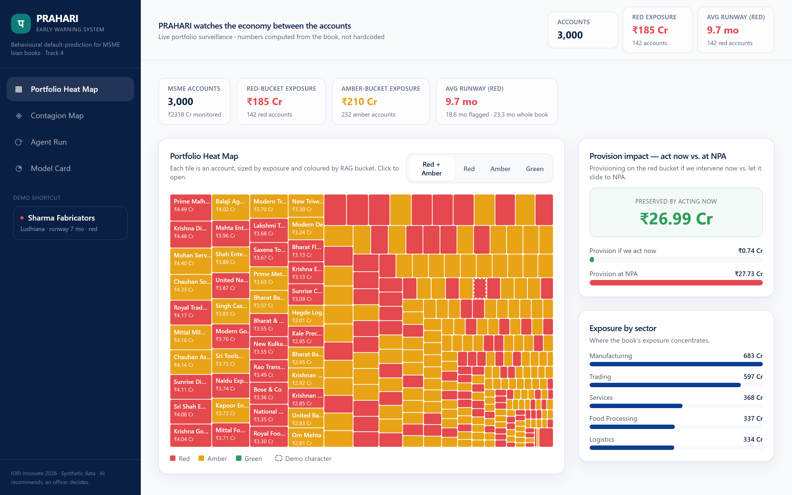
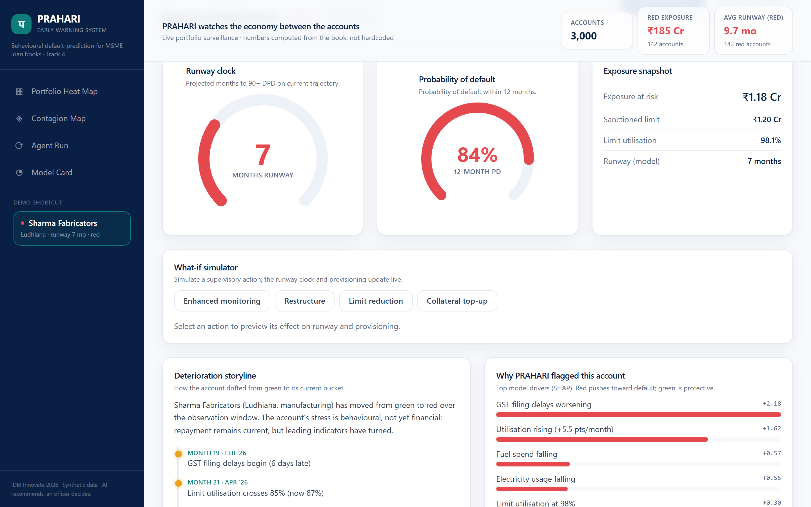
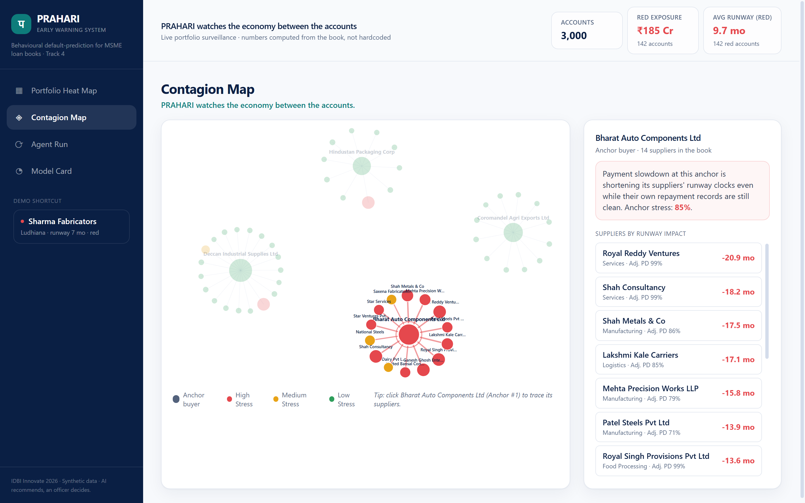
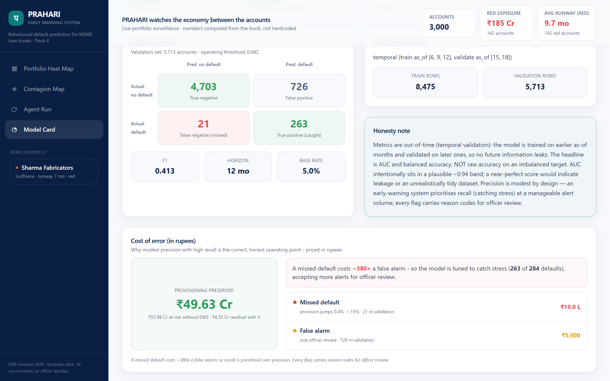
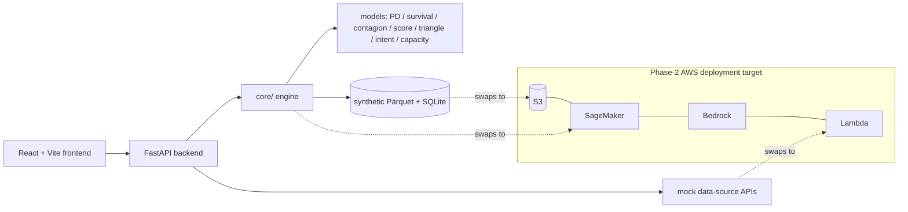

# PRAHARI - Predicts loan-account stress 12 months ahead

> Predicts loan-account stress 12 months ahead - runway clocks, a contagion graph, and auto-drafted SMA memos.



**Built for IDBI Innovate 2026 - Track 4: Default Prediction (Early Warning System) By the U-Team**

Runs entirely on **synthetic data we generate** (deterministic, `--seed 42`). External data
sources are **mock APIs** designed to swap for the IDBI sandbox endpoints in phase 2.

## The problem (in the bank's numbers)
A ₹-crore MSME book turns into NPAs that were flagged only at 90+ DPD - when provisioning has already jumped from 0.4% to 15% and recovery is hardest.

## The solution
- 12-month probability-of-default (XGBoost) with **honest, out-of-time metrics** (AUC ≈ 0.94, balanced accuracy ≈ 0.88 - not a rigged 0.99).
- Runway clock: expected months to 90+ DPD per account.
- Deterioration storyline + SHAP reason codes for every flag.
- Contagion graph: models stress spreading down anchor→supplier payment chains.
- What-if simulator (restructure / limit cut / collateral / monitoring) → new runway + ₹ provisioning delta.
- One-click SMA memo & CRILC report generation; a monthly agent run that compiles the watch-list.

<p>  </p>

## The contagion model, auditable
Stress diffuses over the directed anchor→supplier payment graph. Each node carries its own
stress `s_i ∈ [0,1]` (suppliers: their model PD; anchors: payment-disruption level). For two
iterations, stress propagates downstream:

```
s_j  +=  Σ_i  w_ij · s_i · dependency_ij
```

where `dependency_ij` is payer *i*'s share of payee *j*'s inflows and `w_ij` is the payment
regularity of that edge. Output per node: contagion-adjusted PD, runway delta, and a
plain-language "why" naming the upstream cause. No black box - a credit officer can recompute
any node by hand from the edge table (`edges.parquet`).

## Cost of error, in rupees
A missed default costs ~380× a false alarm (provisioning jumps 0.4% → 15% on the exposure vs one
officer review). The model is therefore tuned for **recall at a manageable alert volume** - the
Model Card screen shows the full confusion matrix and the ₹ provisioning preserved on the
out-of-time validation fold.


## Architecture

Phase-2 mapping: models → **SageMaker**, LLM narratives → **Bedrock**, mock integrations → **Lambda**, data → **S3**.

## Quickstart
```bash
make demo          # install, build frontend, generate data, train models, serve
# → open http://localhost:8001
```
Or with Docker:
```bash
docker build -t prahari-ews .
docker run -p 8001:8001 prahari-ews
```
No API keys required - the demo runs fully offline with deterministic template narratives.
Set `ANTHROPIC_API_KEY` (see `.env.example`) to enable LLM-authored documents.

## Data & honesty note
- **All data is synthetic by design** - no real customer data is used at this stage.
- **Mock APIs** (GST / Account-Aggregator / electricity / EPFO) return realistic JSON and swap to
  the IDBI sandbox in phase 2.
- **Metric methodology:** temporal (out-of-time) validation; the headline is AUC / balanced
  accuracy, never raw accuracy on an imbalanced target. Metrics sit in a *plausible* band by
  design - a near-perfect score would signal leakage or an unrealistic dataset.

## Regulatory alignment
RBI SMA-0/1/2 ladder, IRAC provisioning (standard 0.4% / sub-standard 15%), CRILC reporting, EWS Master Directions. Human-in-the-loop: every document is a draft for officer review.

## Team & contact
**The U-Team** - IDBI Innovate 2026 submission. Contact: [arungkind@gmail.com](mailto:arungkind@gmail.com), shriramkv@gmail.com, girimercury97@gmail.com, vrsuba@gmail.com**

---
_Every AI-generated document in this app ends with: "Draft prepared by PRAHARI AI. For officer review - not a final decision."_
