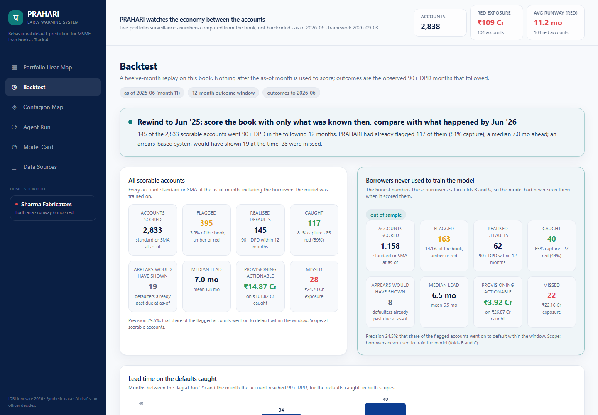
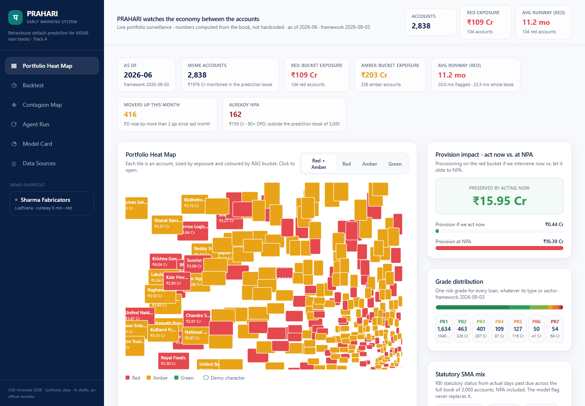
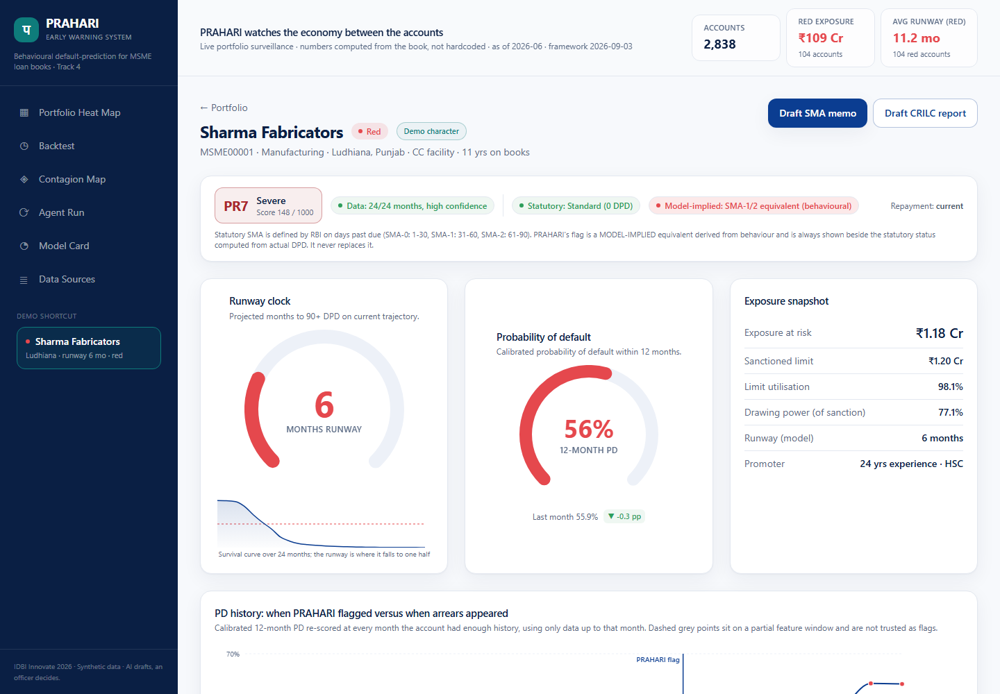
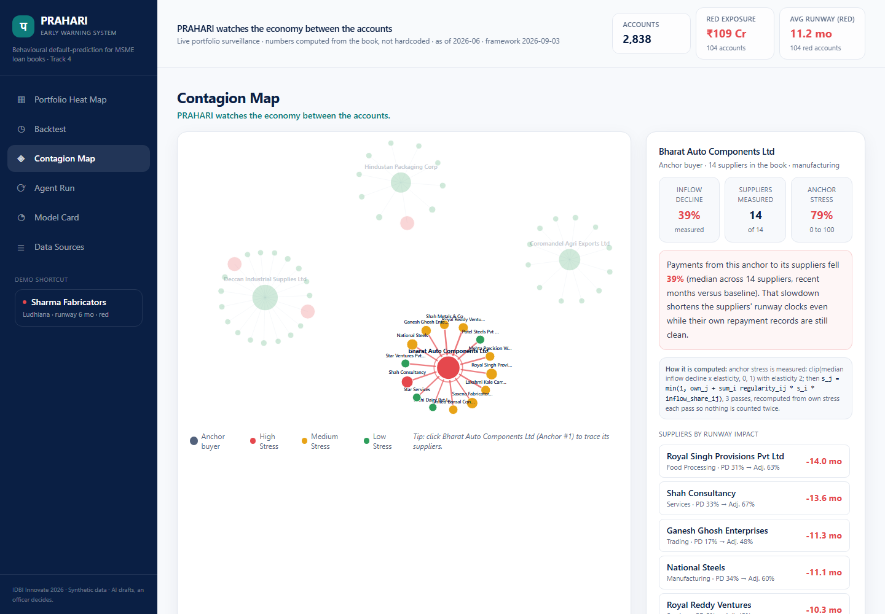
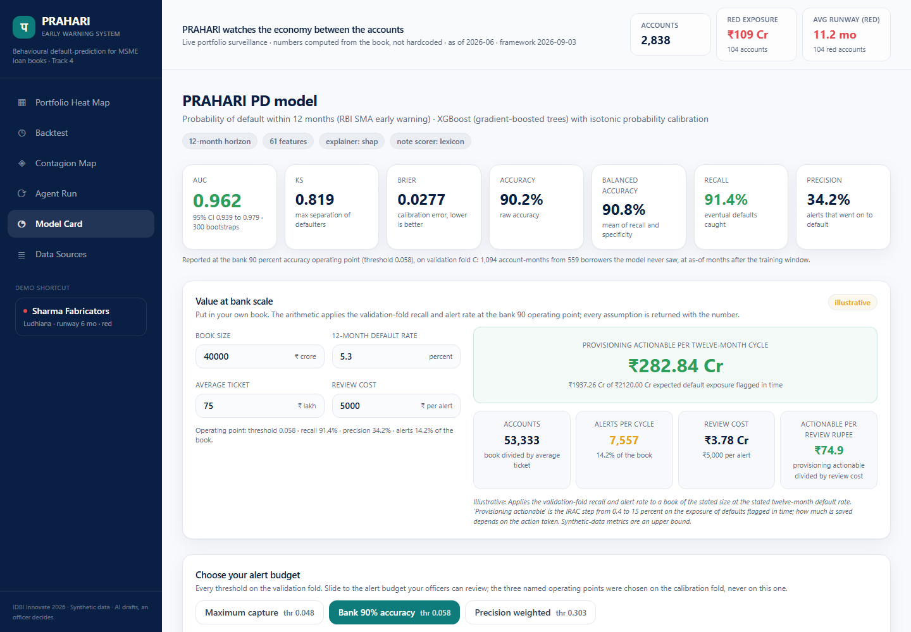
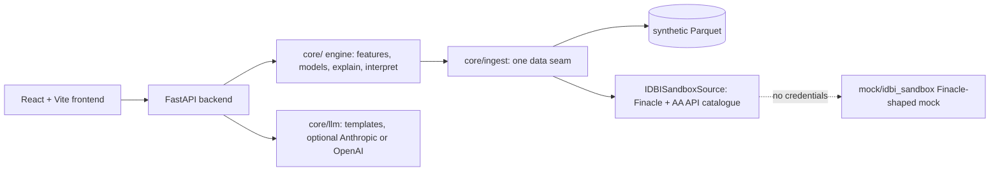

# PRAHARI - Predicts loan-account stress 12 months ahead

> Predicts loan-account stress 12 months ahead - runway clocks, a contagion graph, and auto-drafted SMA memos.



**Built for IDBI Innovate 2026 - Track 4: Default Prediction (Early Warning System).** Shortlisted to the top 24;
this is the refined prototype. **Live demo: https://13-200-31-140.sslip.io**

Runs on **synthetic data we generate** (deterministic, `--seed 42`). Data enters the engine through
one seam (`core/ingest`): the synthetic world by default, or `IDBISandboxSource`, an adapter built
against IDBI's Finacle and Account Aggregator API catalogue (14 of 19 monthly inputs and the
default label come from core banking alone). Without credentials a Finacle-shaped mock of that
catalogue (`mock/idbi_sandbox`) serves the same shapes, and a round-trip test proves the adapter
reproduces the mapped columns through it.

## The problem (in the bank's numbers)
A rupee-crore MSME book turns into NPAs that were flagged only at 90+ DPD, when provisioning has already jumped from 0.4% to 15% and recovery is hardest.

## The solution
- 12-month probability of default (XGBoost, isotonic-calibrated) with **borrower-disjoint temporal validation**: reported on borrowers never seen, at as-of months after training, thresholds chosen on a separate fold, no refit.
- Model Card evidence pack: AUC with bootstrap interval, three named operating points (including the bank's 90 percent accuracy point) plus the full threshold curve, decile capture, lead-time curve, baselines at matched alert budgets, calibration, segment metrics by loan type / sector / vintage, PSI.
- Runway clock learned as a **discrete-time hazard** (months to 90+ DPD from the survival curve), evaluated for timing (concordance, error in months), not a re-labelled PD.
- One **interpretation framework**: calibrated PD to Risk Grade PR1-PR7, RAG, model-implied SMA-equivalent shown beside statutory SMA (days past due), IRAC provisioning, action ladder; pillar sub-scores (Conduct, Compliance, Activity, External, Promoter profile, Officer notes, Contagion).
- IDBI-indicated conduct signals: drawing-power gap and drawings over DP (API 441), liens (API 362), stock-statement submission, anchor-attributable inflows from statement payers (API 393).
- Unstructured input: free-text officer notes scored for sentiment and risk themes, shown on the timeline, cited in the memo, and scoreable live from a text box.
- Contagion graph with **measured** anchor stress (decline in anchor inflows times a documented elasticity), Jacobi diffusion with no double counting, per-supplier why, and an anchor stress-scenario endpoint.
- What-if simulator with stated assumptions and sensitivity ranges; SMA memo and CRILC note drafting under **maker-checker** review with a cooling period; RBI EWS indicator mapping per account.
- Data ingestion seam: synthetic parquet or `IDBISandboxSource` against IDBI's Finacle and Account Aggregator API catalogue, with a Finacle-shaped mock server and a round-trip contract test.

<p>   </p>

## The contagion model, auditable
Stress diffuses over the directed anchor-to-supplier payment graph. Each node has its own stress
`own_i` in [0, 1] (suppliers: calibrated PD; anchors: MEASURED payment stress). Every pass
recomputes each node from its own stress, so nothing is counted twice:

```
s_j = min(1, own_j + sum_i regularity_ij * s_i * inflow_share_ij)
```

Anchor stress is measured, not assumed: the median decline in anchor-attributable inflows across
its suppliers (recent months versus baseline) times a single documented elasticity
(`CONTAGION.inflow_loss_to_stress`), clipped to [0, 1]. Output per node: contagion-adjusted PD,
runway delta, and a plain-language why naming the upstream cause and the measured decline. A credit
officer can recompute any node by hand from the edge table.

## Validation you can check
Borrowers are hashed into folds A (train, 60%), B (calibration and thresholds, 20%) and C
(reported, 20%). The classifier is fit on A at as-of months 6, 9 and 12; every reported number is
from fold C at months 15 and 18. The deployed model is the evaluated model. `core/tests` includes
a leakage guard on the production pipeline (every column corrupted after as-of, features unchanged),
a label-window test, exact-arithmetic contagion tests, and the adapter round-trip against the mock.

## Cost of error, in rupees
A missed default costs hundreds of times a false alarm (provisioning jumps 0.4% to 15% on the
exposure versus one officer review). The Model Card prices the confusion matrix at the operating
point and lets the bank choose its own alert budget on a threshold slider.


## Architecture

```mermaid
flowchart LR
  UI[React + Vite frontend] --> API[FastAPI backend]
  API --> ENG[core/ engine: features, models, explain, interpret]
  ENG --> ING[core/ingest: one data seam]
  ING --> SYN[(synthetic Parquet)]
  ING --> IDBI[IDBISandboxSource: Finacle + AA API catalogue]
  IDBI -. no credentials .-> MOCK[mock/idbi_sandbox Finacle-shaped mock]
  API --> LLM[core/llm: templates, optional Anthropic or OpenAI]
```

## Quickstart
```bash
make demo          # install, build frontend, generate data, train models, serve
# open http://localhost:8001
```
Or with Docker (artefacts are baked at build time; boot is seconds):
```bash
docker build -t prahari-ews .
docker run -p 8001:8001 prahari-ews
```
Run the adapter against the mock catalogue:
```bash
uvicorn mock.idbi_sandbox.server:app --port 8790
DATA_SOURCE=idbi_sandbox IDBI_BASE_URL=http://localhost:8790 IDBI_CIF_LIMIT=150 uvicorn backend.app:app --port 8001
```
No API keys required. Set `ANTHROPIC_API_KEY` or `OPENAI_API_KEY` (see `.env.example`) to have an
LLM polish the drafted documents; every number in them still comes from the template.

## Data and honesty note
- **All data is synthetic by design.** No real customer data is used. Synthetic data is cleaner
  than a real book, so the reported metrics are an upper bound on what the method would achieve on
  IDBI data; the method, not the number, is what transfers.
- **Metric methodology:** borrower-disjoint temporal validation, thresholds chosen on a separate
  calibration fold, deployed model identical to the evaluated one. The headline is reported at the
  operating point that meets the bank's stated 90 percent accuracy requirement, with the maximum
  capture point and the full threshold curve alongside.
- **Statutory versus model-implied:** RBI SMA is defined by days past due and is always shown from
  actual DPD. PRAHARI's flag is a model-implied equivalent placed beside it, never in place of it.

## Regulatory alignment
RBI SMA-0/1/2 ladder (statutory, by days past due) shown beside the model-implied equivalent; IRAC provisioning (standard 0.4% / sub-standard 15%); CRILC threshold logic; EWS indicator families from the 2024 Master Directions. Human-in-the-loop: every document is a draft for officer review, recorded under maker-checker.

## Team & contact
**The U-Team** - IDBI Innovate 2026 submission. Contact: [arungkind@gmail.com](mailto:arungkind@gmail.com).

---
_Every AI-generated document in this app ends with: "Draft prepared by PRAHARI AI. For officer review - not a final decision."_
